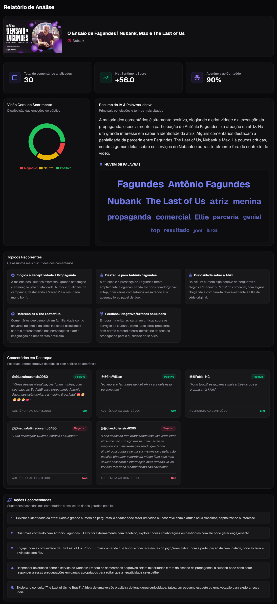

# ▶️ YouTube AI Analyzer

**Transforme comentários do YouTube em inteligência de audiência com Gemini AI em poucos minutos**

## [→ Experimente agora](https://social-listening-oowe.onrender.com)

 

---

## A ideia por trás do projeto

Analisar comentários de vídeos é uma etapa recorrente no trabalho de marketing — mas que consome tempo desproporcional ao valor que gera. Classificar sentimento, identificar tópicos e sintetizar padrões manualmente tira o foco do que realmente importa: a análise da campanha.

Este produto de dados simplifica esse processo com IA: cole o link de qualquer vídeo do YouTube e obtenha em segundos uma leitura estruturada do que a audiência está dizendo, sentindo e esperando — liberando o analista para se dedicar à interpretação e à tomada de decisão.

> Desenvolvido por um analista de dados com quase 8 anos de experiência no Nubank, atuando na interseção entre Marketing Analytics, Growth e CX — incluindo a estruturação de fluxos de social listening com IA generativa que reduziram em 40% o tempo de análise.

---

## O que a ferramenta entrega

- **Análise de sentimento**
Distribuição do público em positivo, neutro e negativo — com percentuais precisos e visualização imediata.

- **Tópicos recorrentes**
Os temas mais discutidos nos comentários, agrupados e descritos automaticamente pela IA. Sem configuração manual.

- **Mapa de palavras-chave**
Os 15 termos mais relevantes da conversa, ponderados por frequência e importância semântica.

- **Ações recomendadas**
De 3 a 5 sugestões práticas geradas pela IA com base nos padrões identificados no feedback da audiência.

- **Sugestão de respostas**
Para cada comentário, o app gera uma resposta no tom de voz do canal — identificado automaticamente pelo título e autor do vídeo.

- **Exportação**
Relatório completo disponível em PDF (dashboard visual) e CSV (tabela com todos os comentários classificados).

---

## Como foi construído

1. **Estruturação da ideia** — definição do problema, escopo e funcionalidades principais
2. **Desenvolvimento via Vibe Coding** — construção do app descrevendo intenções em linguagem natural para a IA, sem codificação manual linha a linha
3. **Integração com YouTube API** — conexão com a YouTube Data API v3 para busca de comentários reais
4. **Integração com Gemini API** — implementação dos fluxos de análise com IA e geração de respostas automáticas
5. **Lançamento** — deploy em produção via Render

---

## Autor

**Gabriel Teixeira**
Data Analyst | Marketing & Growth Analytics | IA Aplicada a Dados

Quase 8 anos de experiência no Nubank na interseção entre Marketing Analytics, Growth e CX. Especialista em mensuração de campanhas, análise de funil, social listening e construção de dashboards executivos. Aplica IA generativa em fluxos de análise qualitativa e categorização de dados não estruturados — com impactos como +108% de crescimento em views no Instagram (438M → 914M) e 40% de redução no tempo de análise de social listening.

